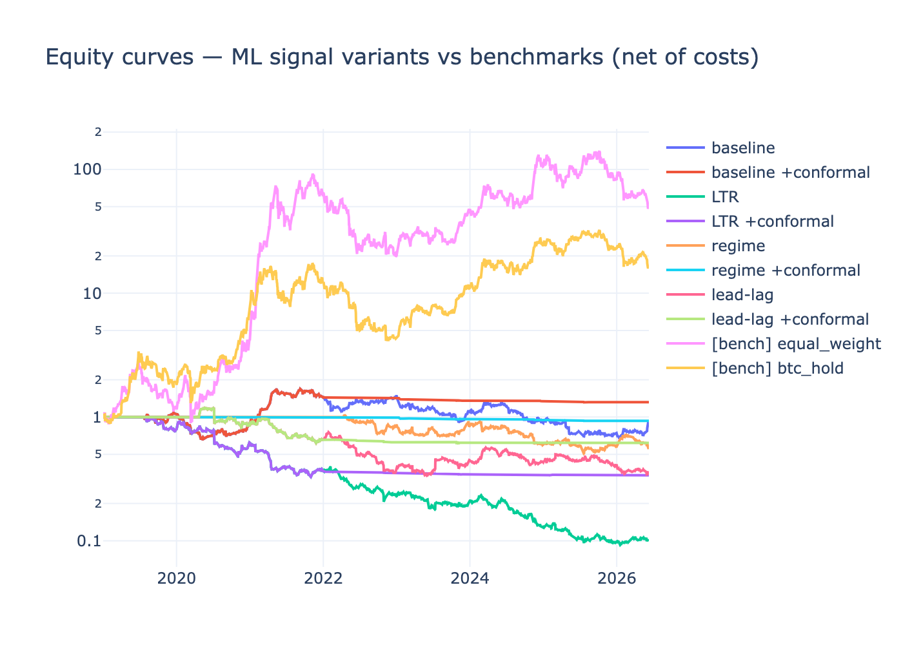
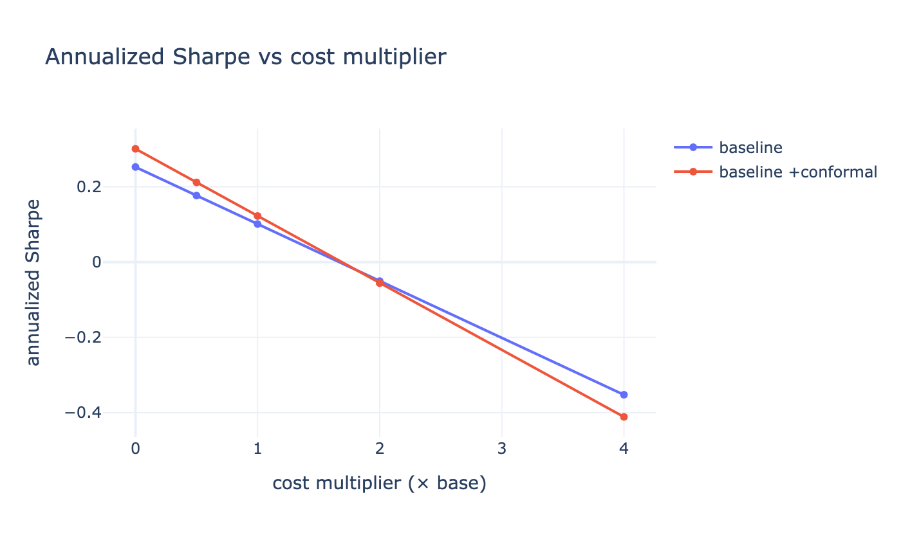

# Meridian — Research Report

*A long/short, vol-targeted, multi-crypto trend strategy, evaluated honestly.*

> **TL;DR.** Built a full, reproducible research stack: multi-asset point-in-time
> data, causal features, a cost-aware long/short vol-targeted backtester,
> walk-forward + purged k-fold validation, and three reframed ML models held to
> an out-of-sample P&L ablation. **The honest finding is negative:** a naive
> cross-sectional SMA-crossover long/short book does **not** beat buy-and-hold on
> a risk-adjusted basis over 2019–2026, and none of the three ML overlays adds
> out-of-sample value. The edge does not survive realistic costs. This document
> reports that result and *why it is the right thing to report.*

All numbers below are reproduced by `python -m meridian.pipeline` (seed 42) and
are written to `research/results/`.

---

## 1. Hypothesis

Cross-sectional momentum/trend is a documented anomaly in many asset classes.
The hypothesis tested here: among liquid crypto majors, ranking by
risk-adjusted momentum and going **long the strongest up-trending names / short
the weakest down-trending names**, sized to a constant volatility target, earns
a positive risk-adjusted return *after costs* — and that ML overlays
(meta-labeling, regime detection) improve it.

We treat this as a falsifiable claim and try hard to falsify it.

## 2. Data

- **Universe (8 majors):** BTC, ETH, BNB, XRP, ADA, SOL, DOGE, LTC (daily, Yahoo
  Finance, auto-adjusted). 2019-01-01 → present (~2,700 daily bars).
- **Point-in-time discipline.** All features/labels/backtests use **closed daily
  bars only**. The live spot price (CoinGecko) is display-only and never mutates
  history — so there is **no repainting**.
- **Survivorship bias (declared).** Yahoo serves only *currently listed* coins,
  so the universe is conditioned on survival; coins that died (e.g. LUNA) are
  absent. This biases results **upward**. We mitigate by letting each asset enter
  the panel only once it has real history (SOL starts late, not back-filled), but
  we do **not** claim to eliminate the bias. Any positive result would need to be
  discounted for it; our result is negative, so the bias only makes the true
  picture weaker, not stronger.

## 3. Methodology

**Signal.** Per asset, the SMA50/SMA200 relation defines a trend regime; golden/
death crosses are the entry events. On a weekly rebalance we rank the universe by
risk-adjusted momentum (90d return ÷ realized vol) and go long the top 3 that are
in an uptrend, short the bottom 3 in a downtrend.

**Sizing.** Inverse-volatility (vol-parity) weights, then the whole book is scaled
to a 20% annualized vol target using the *trailing* realized vol of the gross-1
strategy (causal), capped at 2× gross leverage and 40% per asset.

**Costs.** Every rebalance pays taker fee (10 bps) + half-spread (4 bps) +
slippage (5 bps) = **19 bps per side**, charged on turnover. A sweep multiplies
the whole stack by 0× / 0.5× / 1× / 2× / 4×.

**Causality.** A weight applied to the return over [t−1, t] is decided using
information available no later than t−1 (`weights.shift(1)`). Indicators are
backward-looking; tests assert no look-ahead.

**Validation.**
- *Walk-forward* (rolling 3y train → 6m test) for the strategy, to check
  temporal stability rather than a single full-sample number.
- *Purged k-fold with embargo* (López de Prado) for the ML models: a label's
  outcome window [event, t1] that overlaps a test fold is **purged** from
  training, with an embargo after each fold. This is what makes the ML metrics
  trustworthy.
- *Deflated Sharpe Ratio.* Every reported Sharpe is deflated by the number of
  configurations tried (4), so selecting the "best" variant is penalised — the
  antidote to backtest overfitting.

## 4. ML reframing (kept, but made honest)

| Model | Old (broken) | Reframed |
|---|---|---|
| **LSTM** | predicted raw price levels; scaler fit on full series; in-sample band | predicts **stationary log-returns**; chronological train/val/test; scaler fit on train only; benchmarked vs **random walk** |
| **Random Forest** | trained & displayed in-sample on a handful of trades | **meta-labeling** (take/skip a signal) with **triple-barrier** labels, evaluated by **purged k-fold**, reported as OOS AUC |
| **Isolation Forest** | refit on full history incl. the scored point | **walk-forward regime filter**: fit on trailing window, score the *next, unseen* day; scales exposure down in abnormal regimes |

Crucially, each overlay enters the strategy only through a **causal exposure
multiplier in [0,1]**, so the ablation's "with vs without" comparison is fair.

## 5. Results (net of 1× costs, out-of-sample)

| Variant | Ann. return | Ann. vol | Sharpe | Max DD | Deflated Sharpe |
|---|---:|---:|---:|---:|---:|
| baseline | −1.6% | 23.6% | **0.05** | −60.3% | 0.18 |
| + regime filter | −6.6% | 22.5% | −0.19 | −66.3% | 0.06 |
| + meta-label gate | −2.0% | 20.0% | −0.00 | −53.5% | 0.15 |
| + regime + meta | −5.7% | 18.9% | −0.22 | −59.1% | 0.05 |
| **[bench] equal-weight** | **+68.5%** | 75.8% | **1.07** | −78.4% | 1.00 |
| **[bench] BTC buy-and-hold** | **+45.1%** | 61.4% | **0.92** | −76.6% | 0.99 |



**Cost sensitivity (annualized Sharpe):**

| Cost ×  | per-side bps | baseline Sharpe | +regime+meta Sharpe |
|---:|---:|---:|---:|
| 0.0 | 0.0 | 0.20 | 0.05 |
| 0.5 | 9.5 | 0.13 | −0.08 |
| 1.0 | 19.0 | 0.05 | −0.22 |
| 2.0 | 38.0 | −0.10 | −0.49 |
| 4.0 | 76.0 | −0.39 | −1.03 |



**ML diagnostics:**
- **LSTM (BTC, 5-day log-return):** OOS RMSE 0.0495 vs random-walk 0.0475 →
  **does not beat the naive baseline** (`beats_baseline = False`). Directional
  accuracy 51.5% vs 48.0% — marginal and not enough to overcome worse magnitude
  error.
- **RF meta-label:** 130 events, base rate 41.5%, **OOS AUC 0.38** — *below* 0.5,
  i.e. no usable predictive signal on this event set out-of-sample.
- **Regime filter:** flags ~7.6% of days abnormal (≈ contamination), but cutting
  exposure in those windows **hurt** risk-adjusted return here.

## 6. Verdict

1. **No edge over beta.** A market-neutral-ish crossover L/S sacrifices the large
   directional return that made buy-and-hold win 2019–2026; on a risk-adjusted
   basis it does not compensate. Even at **zero cost** the baseline Sharpe is only
   ~0.20, and it is negative by 1× costs.
2. **The ML overlays do not help.** Each fails its OOS ablation: the meta-label
   AUC is below chance, the LSTM doesn't beat a random walk, and the regime filter
   degrades performance. Per the pre-committed rule ("prove OOS lift or be
   shelved"), none earns inclusion in a live book.
3. **Deflated Sharpe confirms it.** After deflating for the 4 configurations
   tried, no strategy variant is statistically distinguishable from noise
   (DSR ≤ 0.18), while the benchmarks are ~1.0.

This is the intended outcome of rigorous evaluation. The contribution is the
**infrastructure and the honesty**, not a manufactured edge.

## 7. Limitations & next research directions

- **Survivorship bias** inflates the universe (upward); the true picture is
  weaker still.
- **Daily bars, single venue.** No intraday structure, funding, or borrow costs
  for shorts (a real short book pays more — another headwind we did not even add).
- **Few events.** 130 crossover events over 6 years give the meta-labeler wide
  error bars; this is a data-scarcity problem, not just a model problem.
- **Promising directions:** (a) test the long-only / long-biased variant to keep
  some beta; (b) larger, point-in-time universe with delisted coins to kill
  survivorship bias; (c) faster signals / shorter horizons where cross-sectional
  momentum is stronger; (d) funding-rate and on-chain features for the meta-label.

## 8. Reproducibility

```bash
pip install -r requirements.txt
python -m meridian.pipeline          # full run (writes research/results/)
python -m pytest tests/ -q           # 43 tests: causality, accounting, no-leakage
```

One seed (`config/config.yaml: seed: 42`), one config, deterministic outputs.
